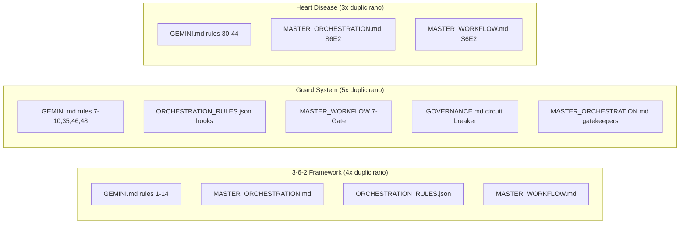
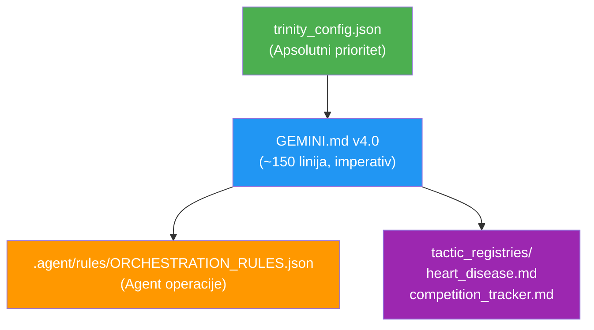

# GEMINI.md Konsolidacija — Detaljna Analiza i Plan

## Problem

Pravila, konfiguracija i domenska znanja su rasuta na **7+ fajlova** sa masivnim duplikacijom i kontradiktornim verzijama.

## Inventar Fragmenata

| Fajl | Linije | Funkcija | Status |
|------|--------|----------|--------|
| [GEMINI.md](file:///home/kizabgd/Desktop/Istrazivanje/GEMINI.md) | 232 | Glavni ustav (Q&A format, 50 pravila) | ⚠️ Mix sistemskog + domenskog |
| [trinity_config.json](file:///home/kizabgd/Desktop/Istrazivanje/trinity_config.json) | 124 | Parametri (thresholds, API, modeli) | ✅ Ostaje |
| [ORCHESTRATION_RULES.json (.agent)](file:///home/kizabgd/Desktop/Istrazivanje/.agent/rules/ORCHESTRATION_RULES.json) | 244 | Agent ops, JudgeGuard, registry | ✅ Ostaje |
| [ORCHESTRATION_RULES.json (root)](file:///home/kizabgd/Desktop/Istrazivanje/ORCHESTRATION_RULES.json) | 33 | Zastarela kopija | 🗑️ Briši |
| [MASTER_ORCHESTRATION.md](file:///home/kizabgd/Desktop/Istrazivanje/.agent/rules/MASTER_ORCHESTRATION.md) | 28 | Hijerarhija, 3-6-2, Heart specifics | 🗑️ Apsorbuj |
| [product_constitution.md](file:///home/kizabgd/Desktop/Istrazivanje/.agent/rules/product_constitution.md) | 17 | Misija, nepromenjlivi zakoni | 🗑️ Apsorbuj |
| [GOVERNANCE.md](file:///home/kizabgd/Desktop/Istrazivanje/GOVERNANCE.md) | 40 | Security, circuit breaker | 🗑️ Apsorbuj |
| [MASTER_WORKFLOW_PROTOCOL.md](file:///home/kizabgd/Desktop/Istrazivanje/MASTER_WORKFLOW_PROTOCOL.md) | 52 | 7-Gate, S6E2, 3-6-2 | 🗑️ Apsorbuj |

**Ukupno rasuto:** 369+ linija na 5 fajlova → konsolidacija u **~150 linija**

---

## Mapa Duplikacije

---

## Predložena Nova Arhitektura

---

## Nova Struktura GEMINI.md v4.0

| Sekcija | Sadržaj | Izvor | ~Linija |
|---------|---------|-------|---------|
| **§0 META** | Verzija, meta komanda, prioritet JSON | GEMINI.md header | 5 |
| **§1 IDENTITET** | Misija, 5 nepromenjljivih zakona | product_constitution.md | 15 |
| **§2 HIJERARHIJA** | Redosled autoriteta fajlova | MASTER_ORCHESTRATION.md | 10 |
| **§3 EXECUTION** | 3-6-2, CLI, Legacy Integration, Phase-Aware | GEMINI rules 1-6,15-16,50 | 30 |
| **§4 GUARDRAILS** | ProcessGuard, JudgeGuard, 7-Gate, Circuit Breaker | GEMINI rules 7-10,35,46,48 + GOVERNANCE + MASTER_WORKFLOW | 40 |
| **§5 MEMORY & ERRORS** | Memory Integrity, Graceful Degradation, Scaling | GEMINI rules 19-20,25-28,49 | 20 |
| **§6 DOMENSKI REGISTRI** | Referenca na tactic_registries/ | GEMINI rule 45 | 10 |
| **§7 ANTI-REGRESSION** | 5 anti-regression pravila | ORCHESTRATION_RULES.json | 10 |
| **APPENDIX** | File reference mapa | Novo | 10 |
| **TOTAL** | | | **~150** |

### Ključne Promene

1. **Q&A → Imperativ**: eliminisanje pitanja, samo direktive
2. **Heart Disease → `tactic_registries/heart_disease.md`**: pravila 30-44 + breakthrough strategije
3. **Numeričke vrednosti → `trinity_config.json`**: nula hardcoded pragova u ustavu
4. **5 fajlova → 1 fajl**: GOVERNANCE, MASTER_WORKFLOW, product_constitution, MASTER_ORCHESTRATION — sve apsorbovano

---

## Proposed Changes

### Tactic Registries

#### [NEW] [heart_disease.md](file:///home/kizabgd/Desktop/Istrazivanje/tactic_registries/heart_disease.md)
Sadržaj: GEMINI.md pravila 30-44 + alternativni pristupi (RealMLP, AutoGluon, Zone-RF) + lekcije + anti-patterni

#### [NEW] [competition_tracker.md](file:///home/kizabgd/Desktop/Istrazivanje/tactic_registries/competition_tracker.md)
Sadržaj: Registar takmičenja iz ORCHESTRATION_RULES.json

---

### Core Constitution

#### [MODIFY] [GEMINI.md](file:///home/kizabgd/Desktop/Istrazivanje/GEMINI.md)
Potpuno prepisivanje iz Q&A u imperativni format sa 7 sekcija (~150 linija)

---

### Cleanup / Archive

#### [DELETE] [ORCHESTRATION_RULES.json (root)](file:///home/kizabgd/Desktop/Istrazivanje/ORCHESTRATION_RULES.json)
Zastarela kopija — `.agent/rules/` verzija je kanonska

#### [ARCHIVE → .legacy/] Sledeći fajlovi:
- [GOVERNANCE.md](file:///home/kizabgd/Desktop/Istrazivanje/GOVERNANCE.md) → `.legacy/archived_governance.md`
- [MASTER_WORKFLOW_PROTOCOL.md](file:///home/kizabgd/Desktop/Istrazivanje/MASTER_WORKFLOW_PROTOCOL.md) → `.legacy/archived_master_workflow.md`
- [MASTER_ORCHESTRATION.md](file:///home/kizabgd/Desktop/Istrazivanje/.agent/rules/MASTER_ORCHESTRATION.md) → `.legacy/archived_master_orchestration.md`
- [product_constitution.md](file:///home/kizabgd/Desktop/Istrazivanje/.agent/rules/product_constitution.md) → `.legacy/archived_product_constitution.md`

---

## User Review Required

> [!IMPORTANT]
> **Workflow fajlovi u `.agents/`**: Imam 6 workflow fajlova u `.agents/workflows/` (trinity_start, trinity_dashboard, trinity_harvest, trinity_killshot, mistral_trigger, plan). Da li da ih premestim u `.agent/workflows/` i obrišem `.agents/` direktorijum?

> [!WARNING]
> **Ovo je destruktivna promena**: Stari GEMINI.md (Q&A format) biće potpuno zamenjen. Sav sadržaj ostaje u sistemu (tactic registries + konsolidovan ustav), ali format je drastično drugačiji.

> [!CAUTION]
> **user_rules duplikacija**: GEMINI.md se pojavljuje DVAPUT u user_rules sekciji (identican sadržaj od 232 linije × 2 = 464 linije konteksta). Novim formatom od ~150 linija, čak i sa duplikacijom, to postaje 300 linija — ušteda od ~164 linije konteksta po promptu.

---

## Verification Plan

### Manual Verification
1. **Sadržaj audit**: Nakon pisanja novog GEMINI.md, preći originalni fajl red po red i potvrditi da svako pravilo ima dom u novom fajlu ILI u tactic_registries/
2. **Cross-reference check**: `grep -r "GOVERNANCE.md\|MASTER_WORKFLOW\|product_constitution\|MASTER_ORCHESTRATION" scripts/ .agent/ src/` — potvrda da nijeden skript ne referencira arhivirane fajlove
3. **JSON validnost**: Potvrda da trinity_config.json i ORCHESTRATION_RULES.json nisu izmenjeni
4. **User review**: Kiza pregleda novi GEMINI.md i tactic registries pre finalizacije
