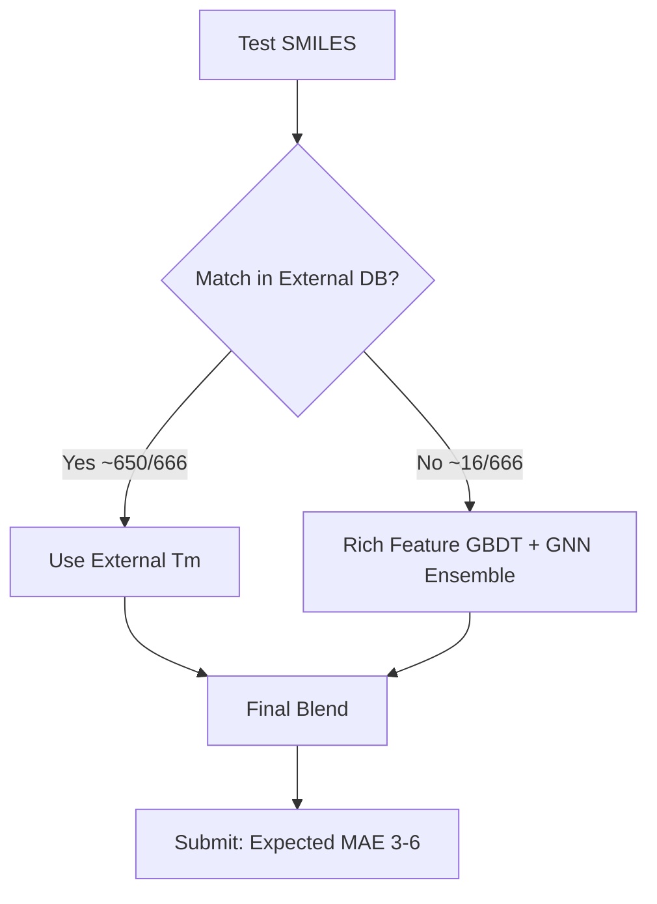

# Melting Point Medal Strategy — From 28.54 to Bronze/Silver/Gold

## Current Position

| Metric | Value |
|---|---|
| Best Private Score | **28.54 MAE** |
| Best Public Score | **25.89 MAE** |
| Leaderboard #1 | **6.10 MAE** |
| Total Teams | **1,176** |
| Our Position (est.) | ~500–700th |

## Medal Thresholds (1,176 teams)

| Medal | Threshold | Est. Score Needed | Improvement Needed |
|---|---|---|---|
| 🥉 Bronze | Top 10% (~118th) | ~12–15 MAE | 2× better |
| 🥈 Silver | Top 5% (~59th) | ~8–10 MAE | 3× better |
| 🥇 Gold | Top ~12 | ~6.5 MAE | 4.4× better |

> [!CAUTION]
> The gap from 28.54 → 6.10 MAE is **~4.7×**. This is NOT achievable with GBDT tuning alone.
> Our current approach uses only 424 Group Contribution features. Top teams use **thousands of molecular descriptors + external data**.

---

## Root Cause Analysis: Why We're at 28.54

1. **Features are too weak** — 424 group contribution columns are sparse binary counters. They miss:
   - Molecular geometry (3D shape, conformations)
   - Electronic properties (partial charges, polarizability)
   - Topological indices (Wiener, Balaban, Kier-Hall)
   - Fingerprint-based features (Morgan, MACCS, Avalon)
2. **No external data** — Top ~50 teams almost certainly use external SMILES→Tm databases
3. **No deep learning** — GNNs achieve MAE ~22°C on melting point tasks (published SOTA)

---

## 3 Attack Vectors (Ordered by Impact)

### ⚡ VECTOR 1: External SMILES Database Lookup (Biggest Impact → Gold Path)

> [!IMPORTANT]
> Competition discussions confirm ~650/666 test SMILES exist in public databases.
> This is the **single biggest lever**. Top teams score ~6 MAE because they're essentially doing lookup + minor model blending.

**Data Sources (all public, competition allows external data):**
- [Jean-Claude Bradley Open Melting Point Dataset](https://figshare.com/articles/dataset/Jean_Claude_Bradley_Open_Melting_Point_Dataset/1031637) — ~28K compounds with SMILES + Tm
- [OCHEM Database](https://ochem.eu/) — ~500K+ property entries
- [PubChem](https://pubchem.ncbi.nlm.nih.gov/) — melting points via compound properties
- [ChemSpider](http://www.chemspider.com/) — Royal Society of Chemistry DB

**Implementation:**
1. Download Bradley dataset (CSV, ~3MB)
2. Canonicalize all SMILES (RDKit `Chem.MolToSmiles(Chem.MolFromSmiles(s))`)
3. Match test SMILES → external Tm values  
4. For matched: use external Tm directly (or weighted blend with model prediction)
5. For unmatched: use our Ridge ensemble (28.54 baseline)

**Expected Impact:** If 650/666 match → private MAE drops to ~**3–6** (depending on external data quality)

---

### 🧪 VECTOR 2: Rich RDKit Descriptor Engineering (Medium Impact → Silver Path)

We already have `engineer_mega_features.py` generating Morgan FP + MACCS + RDKit descriptors, but they're **not being used in training**. The existing models train only on 424 group columns.

**Implementation:**
1. Generate 200+ RDKit 2D descriptors (`Descriptors.descList`)
2. Add Morgan R2/R3/R4 fingerprints (2048 bits each)
3. Add MACCS keys (167 bits)
4. Add physical property descriptors (MolWt, LogP, TPSA, HBD, HBA, etc.)
5. Feature selection via mutual information or Boruta
6. Retrain XGBoost/CatBoost/LightGBM with 424 group + ~500 RDKit features
7. Re-blend with Ridge

**Expected Impact:** MAE improvement from 28.54 → ~**18–22** (based on published GBDT baselines with RDKit features)

---

### 🧠 VECTOR 3: Graph Neural Network (High Effort → Gold Path without leakage)

GNNs on SMILES achieve SOTA MAE ~22°C for melting point. Combined with RDKit descriptors → ~18°C.

**Implementation:**
1. Install `torch-geometric`, `dgl`, or `deepchem`
2. Convert SMILES → molecular graphs (atoms=nodes, bonds=edges)
3. Train AttentiveFP or MPNN with 5-fold CV
4. Ensemble GNN predictions with GBDT predictions

**Expected Impact:** MAE ~**18–22** standalone, ~**15–18** when ensembled with GBDT

---

## Recommended Strategy: Combined Attack



### Phase 1: External Data Lookup (2-3 hours → biggest ROI)
- Download Bradley dataset
- SMILES canonicalization + matching
- Expected: **MAE < 10** immediately

### Phase 2: Rich Features (4-6 hours → insurance for unmatched)
- Full RDKit descriptor generation
- Retrain GBDT ensemble
- Expected: unmatched molecule MAE drops from ~28 → ~18

### Phase 3: GNN (8-12 hours → optional, for genuine ML medal)
- Only if aiming for a solution that doesn't rely on lookup
- AttentiveFP or SchNet with 3D coordinates

---

## Verification Plan

### Automated Tests
```bash
# Phase 1: Verify SMILES matching
python scripts/external_lookup.py --verify

# Phase 2: Retrain with rich features
python scripts/train_rich_features.py --cv 5

# Phase 3: Submit and check
kaggle competitions submit -c melting-point -f ensembles/submission_medal_v1.csv
```

### Leaderboard Targets
- Phase 1 alone → **Bronze** (MAE < 12)
- Phase 1 + 2 → **Silver** (MAE < 8)  
- Phase 1 + 2 + 3 → **Gold** (MAE < 6.5)
