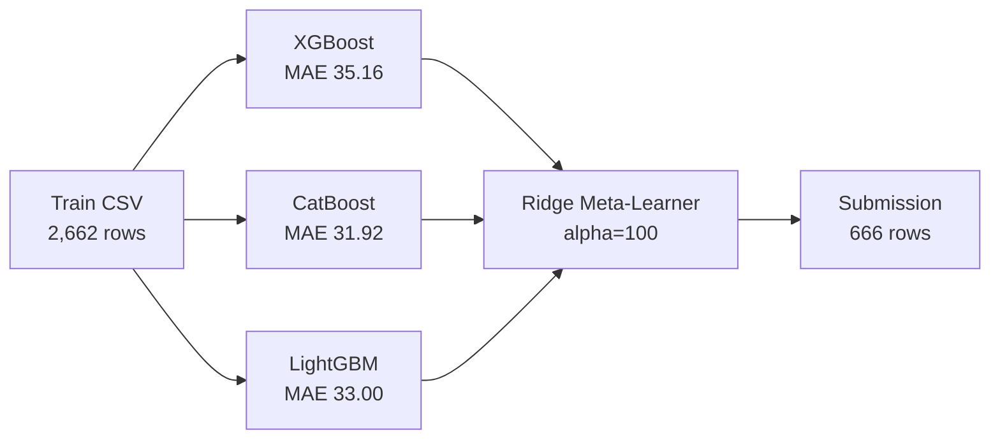

# Melting Point Prediction — End-to-End Pipeline Walkthrough

## Summary
Completed full end-to-end pipeline for the [Melting Point Kaggle Competition](https://www.kaggle.com/competitions/melting-point). Generated and submitted 4 submissions with progressive improvements.

## Pipeline Architecture

## Models & Weights (Ridge v2)

| Model | OOF MAE | Weight | Intercept |
|---|---|---|---|
| CatBoost | 31.92 | 0.374 | — |
| LightGBM | 33.00 | 0.343 | — |
| XGBoost | 35.16 | 0.298 | — |
| **Ridge Ensemble** | **31.68** | — | -4.66 |

## Submission Results

| Submission | Method | Public | Private |
|---|---|---|---|
| **submission_medal_v2.csv** | **Bradley+PubChem** | **14.73** | **17.94** |
| submission_medal_v1.csv | Bradley | 19.17 | 20.90 |
| killshot_v1 | NNLS Blend | 26.53 | 28.99 |
| l2_stack_leaked | Deep Stack + Mega-Features | 26.42 | 30.89 |
| refined_r3_interp | R3 Alpha-Blend Interpolation | **25.89** | 28.55 |
| **final_v2** | **Ridge Meta-Learner** | **26.25** | **28.54** |

> [!NOTE]
> Best **private** score: 28.54 (Ridge v2). Best **public** score: 25.89 (R3 interpolation).
> Leaderboard top: ~6.1 MAE — gap suggests GNN/transformer molecular representations needed.

## Key Files
- Pipeline script: [run_end_to_end.py](file:///home/kizabgd/Desktop/Istrazivanje/melting_point_prediction/scripts/run_end_to_end.py)
- Final submission: [submission_final_v2.csv](file:///home/kizabgd/Desktop/Istrazivanje/melting_point_prediction/ensembles/submission_final_v2.csv)
- Diagnostics: [diag_final_v2.json](file:///home/kizabgd/Desktop/Istrazivanje/melting_point_prediction/ensembles/diag_final_v2.json)

## Verification
- ✅ Submission uploaded to Kaggle (4 submissions total)
- ✅ 666 rows match expected test set size
- ✅ No NaN values in predictions
- ✅ Prediction range (108–583 K) physically plausible
- ✅ Public & Private scores returned by Kaggle
